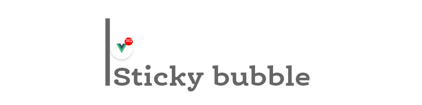
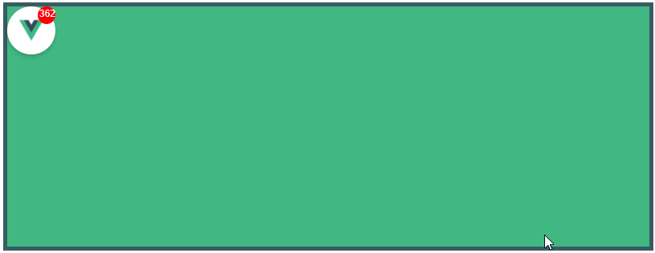

# vue-sticky-bubble
> A floating menu bubble component for vue.js



## Usage
Install via npm or yarn.
```
npm install vue-sticky-bubble
or
yarn add vue-sticky-bubble
```
Load it early in your app
```js
import Vue from 'vue'
import VueStickyBubble from 'vue-sticky-bubble'

Vue.use(VueStickyBubble)
```
Then

```vue
<template>
  <div style="position: relative;">
    <vue-sticky-bubble :size="60" :badgeCount="45" v-on:tapped="tapHandler"></vue-sticky-bubble>
  </div>
</template>

<script>
export default {
  name: 'app',
  methods: {
    tapHandler() {
      // Handle tap
    },
  },
};
</script>
```

### Nuxt.js
Add this as a plugin with SSR disabled.
File: `plugins/vue-sticky-bubble.js`
```js
import Vue from 'vue'
import VueStickyBubble from 'vue-sticky-bubble'

Vue.use(VueStickyBubble)
```
and then in nuxt.config.js
```js
module.exports = {
  plugins: [{
    src: '~/plugins/vue-sticky-bubble',
    ssr: false
  }]
}
```

## Props

| Prop | Type | Description |
| ------ | ------ | ------ |
| size | Number | Diameter of the bubble. Default: 40px. |
| icon | String | path to image to be rendered inside |
| bubbleStyle | Object | Style object for custom bubble style |
| badgeStyle | Object | Style object for custom badge style |
| badgeCount | Number | Number to be displayed on the badge |

## Todo
- [ ] Add unit tests
- [ ] Use semantic versioning

## License
```
The MIT License (MIT)

Copyright © 2018 SahajR

Permission is hereby granted, free of charge, to any person
obtaining a copy of this software and associated documentation
files (the “Software”), to deal in the Software without
restriction, including without limitation the rights to use,
copy, modify, merge, publish, distribute, sublicense, and/or sell
copies of the Software, and to permit persons to whom the
Software is furnished to do so, subject to the following
conditions:

The above copyright notice and this permission notice shall be
included in all copies or substantial portions of the Software.

THE SOFTWARE IS PROVIDED “AS IS”, WITHOUT WARRANTY OF ANY KIND,
EXPRESS OR IMPLIED, INCLUDING BUT NOT LIMITED TO THE WARRANTIES
OF MERCHANTABILITY, FITNESS FOR A PARTICULAR PURPOSE AND
NONINFRINGEMENT. IN NO EVENT SHALL THE AUTHORS OR COPYRIGHT
HOLDERS BE LIABLE FOR ANY CLAIM, DAMAGES OR OTHER LIABILITY,
WHETHER IN AN ACTION OF CONTRACT, TORT OR OTHERWISE, ARISING
FROM, OUT OF OR IN CONNECTION WITH THE SOFTWARE OR THE USE OR
OTHER DEALINGS IN THE SOFTWARE.
```
